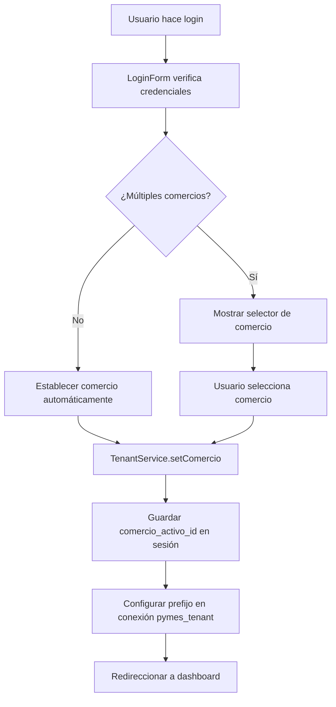
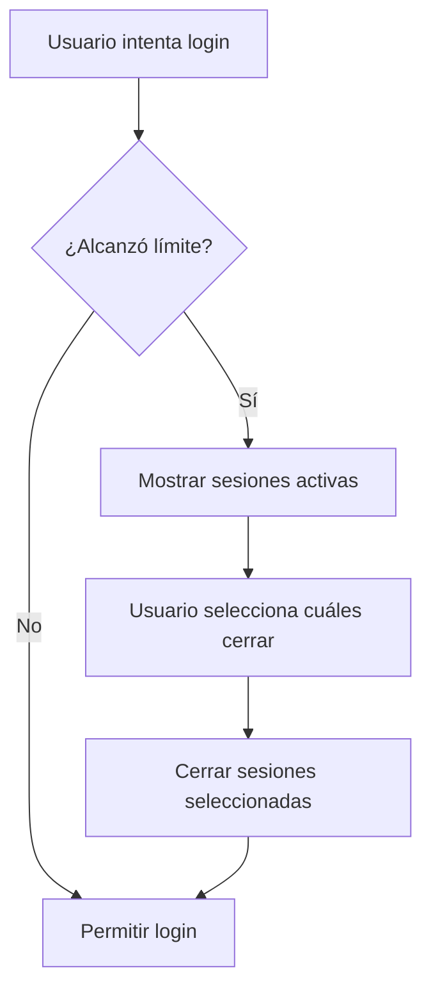
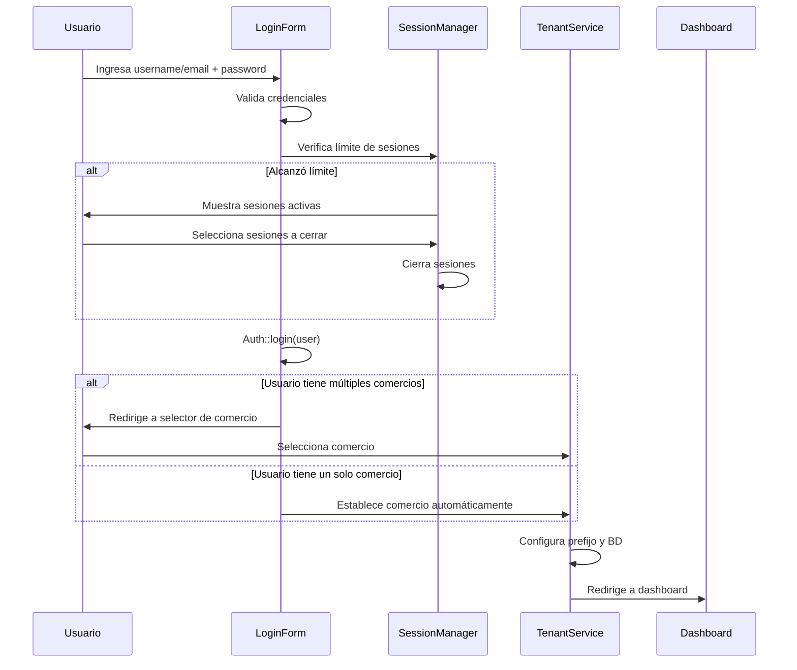
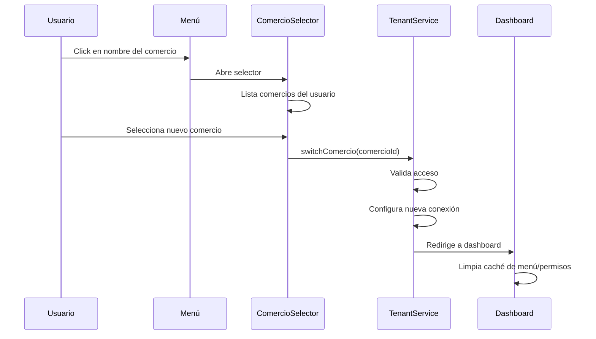
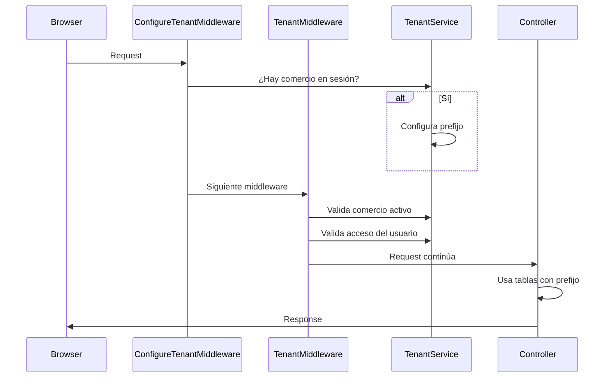

# Arquitectura del Sistema BCN Pymes

**Versión:** 1.0.0
**Última actualización:** 2025-11-06
**Stack:** Laravel 11, Livewire 3, Alpine.js, Tailwind CSS

---

## Tabla de Contenidos

1. [Visión General](#visión-general)
2. [Arquitectura Multi-Tenant](#arquitectura-multi-tenant)
3. [Estructura de Bases de Datos](#estructura-de-bases-de-datos)
4. [Modelos del Sistema](#modelos-del-sistema)
5. [Servicios](#servicios)
6. [Middleware](#middleware)
7. [Componentes Livewire](#componentes-livewire)
8. [Sistema de Permisos](#sistema-de-permisos)
9. [Menú Dinámico](#menú-dinámico)
10. [Sesiones Concurrentes](#sesiones-concurrentes)
11. [Flujos de Usuario](#flujos-de-usuario)
12. [Comandos Artisan](#comandos-artisan)
13. [Optimizaciones Implementadas](#optimizaciones-implementadas)

---

## Visión General

BCN Pymes es un sistema multi-tenant (multi-comercio) diseñado para gestionar múltiples pequeñas y medianas empresas desde una única instalación de Laravel. Cada comercio tiene sus propios datos aislados mediante tablas con prefijo en la base de datos.

### Características Principales

- **Multi-Tenant:** Soporte para múltiples comercios en una sola aplicación
- **Aislamiento de Datos:** Cada comercio tiene sus tablas con prefijo único
- **Multi-Usuario:** Cada usuario puede acceder a múltiples comercios
- **Roles y Permisos Dinámicos:** Sistema de permisos por comercio usando Spatie Permission
- **Menú Dinámico:** Menú generado según permisos del usuario
- **Sesiones Concurrentes:** Control de dispositivos simultáneos por usuario
- **Contraseñas Recuperables:** Sistema para que admins vean contraseñas (cifradas)

---

## Arquitectura Multi-Tenant

### Concepto

El sistema implementa un patrón de multi-tenancy basado en **tablas con prefijo dinámico**. Cada comercio tiene un prefijo único que se aplica a sus tablas en tiempo de ejecución.

### Ejemplo de Estructura

```
Comercio ID: 1 → Prefijo: 000001_
Comercio ID: 2 → Prefijo: 000002_

Base de datos PYMES:
- 000001_roles
- 000001_permissions
- 000001_usuarios
- 000001_articulos
- 000002_roles
- 000002_permissions
- 000002_usuarios
- 000002_articulos
```

### Ventajas de este Enfoque

✅ **Escalabilidad:** Fácil agregar nuevos comercios sin migraciones
✅ **Aislamiento:** Los datos están físicamente separados por tabla
✅ **Performance:** Una sola conexión, menor overhead que múltiples bases de datos
✅ **Mantenimiento:** Un solo código para todos los comercios

### Flujo de Establecimiento del Tenant



---

## Estructura de Bases de Datos

### Base de Datos CONFIG

Almacena información compartida entre todos los comercios:

**Tablas:**
- `comercios`: Información de cada comercio
- `users`: Usuarios del sistema (compartidos)
- `user_comercio`: Relación many-to-many entre usuarios y comercios
- `sessions`: Sesiones activas de usuarios

### Base de Datos PYMES (y variantes: PYMES1, PYMES2, etc.)

Almacena datos específicos de cada comercio con prefijo:

**Tablas Sin Prefijo (compartidas entre comercios):**
- `menu_items`: Estructura del menú (compartida)
- `permissions`: Permisos del sistema (compartidos)

**Tablas Con Prefijo (específicas de cada comercio):**
- `{prefix}_roles`: Roles del comercio
- `{prefix}_model_has_roles`: Asignación de roles a usuarios
- `{prefix}_role_has_permissions`: Permisos de cada rol
- `{prefix}_articulos`: Artículos del comercio
- `{prefix}_ventas_encabezado`: Ventas del comercio
- ... (más tablas de negocio)

### Diagrama de Relaciones

```
┌─────────────────────────────────────────────────────────────┐
│                    BASE DE DATOS: CONFIG                     │
├─────────────────────────────────────────────────────────────┤
│                                                               │
│  ┌──────────────┐         ┌─────────────────┐              │
│  │   usuarios   │─────┬───│  user_comercio  │───┬─────────►│
│  │              │     │   │                 │   │          │
│  │  - id        │     │   │  - user_id      │   │          │
│  │  - name      │     │   │  - comercio_id  │   │          │
│  │  - email     │     │   │  - created_at   │   │          │
│  │  - password  │     │   └─────────────────┘   │          │
│  └──────────────┘     │                         │          │
│                       │   ┌─────────────────┐   │          │
│                       └───│    comercios    │◄──┘          │
│                           │                 │              │
│                           │  - id           │              │
│                           │  - nombre       │              │
│                           │  - database_name│              │
│                           │  - max_usuarios │              │
│                           └─────────────────┘              │
│                                                               │
└─────────────────────────────────────────────────────────────┘

┌─────────────────────────────────────────────────────────────┐
│               BASE DE DATOS: PYMES (o PYMES1, etc.)          │
├─────────────────────────────────────────────────────────────┤
│                                                               │
│  SIN PREFIJO (Compartidas):                                  │
│  ┌──────────────────┐      ┌──────────────────┐            │
│  │   menu_items     │      │   permissions    │            │
│  │  - id            │      │  - id            │            │
│  │  - parent_id     │      │  - name          │            │
│  │  - nombre        │      │  - guard_name    │            │
│  │  - slug          │      └──────────────────┘            │
│  │  - route_type    │                                       │
│  └──────────────────┘                                       │
│                                                               │
│  CON PREFIJO 000001_ (Comercio 1):                          │
│  ┌──────────────────────┐  ┌─────────────────────────┐    │
│  │   000001_roles       │  │  000001_model_has_roles │    │
│  │  - id                │◄─│  - role_id              │    │
│  │  - name              │  │  - model_id (user_id)   │    │
│  │  - guard_name        │  │  - model_type           │    │
│  └──────────────────────┘  └─────────────────────────┘    │
│           │                                                  │
│           │                                                  │
│           ▼                                                  │
│  ┌──────────────────────────────┐                          │
│  │ 000001_role_has_permissions  │                          │
│  │  - role_id                   │                          │
│  │  - permission_id             │                          │
│  └──────────────────────────────┘                          │
│                                                               │
│  ┌──────────────────────┐  ┌─────────────────────────┐    │
│  │  000001_articulos    │  │  000001_ventas_encabez  │    │
│  │  - id                │  │  - id                   │    │
│  │  - codigo            │  │  - numero_venta         │    │
│  │  - nombre            │  │  - fecha                │    │
│  │  - precio            │  │  - total                │    │
│  └──────────────────────┘  └─────────────────────────┘    │
│                                                               │
└─────────────────────────────────────────────────────────────┘
```

---

## Modelos del Sistema

### User (App\Models\User)

**Ubicación:** `app/Models/User.php`
**Conexión:** `config` (base de datos centralizada)
**Propósito:** Representa un usuario del sistema que puede acceder a múltiples comercios

**Propiedades Principales:**
```php
- id: int                           // ID único del usuario
- name: string                      // Nombre completo
- username: string                  // Nombre de usuario (login)
- email: string                     // Email
- password: string                  // Contraseña hasheada
- password_visible: string|null     // Contraseña cifrada (recuperable)
- max_concurrent_sessions: int      // Sesiones simultáneas permitidas
- activo: bool                      // Si puede iniciar sesión
```

**Métodos Importantes:**
- `comercios()`: Relación many-to-many con comercios
- `hasAccessToComercio($comercioId)`: Verifica acceso a un comercio
- `roles()`: Obtiene roles del usuario en el comercio activo
- `hasPermissionTo($permission)`: Verifica si tiene un permiso
- `getAllowedMenuItems()`: Items de menú permitidos (con caché)
- `loadAllPermissions()`: Carga todos los permisos (optimizado con caché)

**Características Especiales:**
- Los permisos son por comercio (no globales)
- Soporta múltiples comercios con diferentes roles en cada uno
- Sistema de caché de permisos (5 minutos) para mejorar performance

### Comercio (App\Models\Comercio)

**Ubicación:** `app/Models/Comercio.php`
**Conexión:** `config`
**Propósito:** Representa un comercio/PYME en el sistema

**Propiedades:**
```php
- id: int               // ID único del comercio
- mail: string          // Email del comercio (usado en login)
- nombre: string        // Nombre comercial
- database_name: string // Base de datos donde están sus tablas (pymes, pymes1, etc.)
- max_usuarios: int     // Máximo de usuarios permitidos
```

**Métodos:**
- `getTablePrefix()`: Obtiene prefijo de tablas (ej: "000001_")
- `users()`: Relación con usuarios
- `canAddMoreUsers()`: Verifica si puede agregar más usuarios
- `getCurrentUsersCount()`: Cantidad de usuarios actuales
- `getRemainingUsersSlots()`: Espacios disponibles para usuarios

### Role (App\Models\Role)

**Ubicación:** `app/Models/Role.php`
**Conexión:** `pymes_tenant` (con prefijo dinámico)
**Propósito:** Representa un rol dentro de un comercio específico

**Hereda de:** `Spatie\Permission\Models\Role`

**Propiedades:**
```php
- id: int          // ID único del rol
- name: string     // Nombre del rol (ej: "Super Administrador")
- guard_name: string // Guard de autenticación (siempre "web")
```

**Métodos:**
- `isProtected()`: Verifica si es el rol "Super Administrador"
- `givePermissionTo()`: Asigna permisos al rol
- `hasPermissionTo()`: Verifica si tiene un permiso

**Nota Importante:** Los roles son específicos de cada comercio (tienen prefijo)

### Permission (App\Models\Permission)

**Ubicación:** `app/Models/Permission.php`
**Conexión:** `pymes` (SIN prefijo, compartido)
**Propósito:** Representa un permiso del sistema

**Propiedades:**
```php
- id: int          // ID único del permiso
- name: string     // Nombre del permiso (ej: "menu.configuracion")
- guard_name: string // Guard (siempre "web")
```

**Nota:** Los permisos son compartidos entre comercios, pero la asignación a roles es por comercio

### MenuItem (App\Models\MenuItem)

**Ubicación:** `app/Models/MenuItem.php`
**Conexión:** `pymes` (SIN prefijo, compartido)
**Propósito:** Representa un item del menú de navegación

**Propiedades:**
```php
- id: int               // ID único
- parent_id: int|null   // ID del padre (null = raíz)
- nombre: string        // Nombre visible en el menú
- slug: string          // Identificador único (ej: "ventas")
- icono: string|null    // Icono de Heroicons
- route_type: enum      // 'route', 'component', 'none'
- route_value: string|null // Valor de la ruta o componente
- orden: int            // Orden de aparición
- activo: bool          // Si está visible
```

**Métodos:**
- `parent()`: Relación con item padre
- `children()`: Relación con items hijos
- `getPermissionName()`: Genera nombre del permiso (ej: "menu.ventas")
- `getUrl()`: Obtiene URL final del item
- `isCurrentRoute()`: Verifica si es la ruta actual

**Estructura Jerárquica:**
```
Dashboard (padre)
Ventas (padre)
  ├── Nueva Venta (hijo)
  ├── Lista de Ventas (hijo)
  └── Reportes (hijo)
Inventario (padre)
  ├── Artículos (hijo)
  └── Stock (hijo)
Configuración (padre)
  ├── Usuarios (hijo)
  └── Roles y Permisos (hijo)
```

---

## Servicios

### TenantService

**Ubicación:** `app/Services/TenantService.php`
**Propósito:** Gestión del tenant (comercio activo) y configuración dinámica de la conexión

**Responsabilidades:**
1. Establecer el comercio activo en la sesión
2. Configurar el prefijo de tablas dinámicamente
3. Configurar la base de datos a usar (pymes, pymes1, etc.)
4. Gestionar la reconexión a la base de datos
5. Validar acceso del usuario al comercio

**Métodos Principales:**

```php
setComercio($comercio): void
// Establece el comercio activo y configura la conexión
// Guarda el ID en sesión y aplica el prefijo a pymes_tenant

getComercio(): ?Comercio
// Obtiene el comercio activo (con caché en memoria)

hasComercio(): bool
// Verifica si hay un comercio establecido

switchComercio($comercio, $userId): bool
// Cambia de comercio con validación de acceso

clearComercio(): void
// Limpia el comercio activo de la sesión
```

**Optimización Importante:**
- Usa caché en memoria (`$comercioCache`) para evitar queries repetidas
- Solo reconecta si cambió el prefijo o la base de datos
- Aplica el prefijo directamente en la conexión instanciada

**Flujo de Configuración:**
```php
// 1. Usuario selecciona comercio
TenantService::setComercio($comercio);

// 2. Guarda en sesión
Session::put('comercio_activo_id', $comercioId);

// 3. Configura conexión
Config::set('database.connections.pymes_tenant.prefix', '000001_');
Config::set('database.connections.pymes_tenant.database', 'pymes');

// 4. Reconecta
DB::purge('pymes_tenant');
DB::reconnect('pymes_tenant');

// 5. Todas las queries usan el prefijo automáticamente
Role::all(); // SELECT * FROM 000001_roles
```

### SessionManagerService

**Ubicación:** `app/Services/SessionManagerService.php`
**Propósito:** Control de sesiones concurrentes por usuario

**Responsabilidades:**
1. Limitar dispositivos simultáneos por usuario
2. Cerrar sesiones más antiguas automáticamente
3. Proporcionar información de sesiones activas
4. Parsear user agents para mostrar dispositivo/navegador

**Métodos Principales:**

```php
hasReachedSessionLimit(User $user): bool
// Verifica si alcanzó el límite de sesiones

getActiveSessionsCount(User $user): int
// Cuenta sesiones activas (limpia expiradas primero)

freeSessionSpace(User $user): int
// Cierra sesiones antiguas para dar espacio

getSessionsInfo(User $user): array
// Información detallada de cada sesión (IP, navegador, etc.)

parseUserAgent(string $ua): array
// Parsea user agent para obtener navegador y OS
```

**Flujo de Login con Límite:**
```php
// Usuario intenta login
if ($sessionManager->hasReachedSessionLimit($user)) {
    // Mostrar modal de confirmación
    // Usuario selecciona qué sesiones cerrar
    $sessionManager->closeSpecificSessions($selectedSessions);
}

// Permitir login
Auth::login($user);
```

---

## Middleware

### TenantMiddleware

**Ubicación:** `app/Http/Middleware/TenantMiddleware.php`
**Aplicado a:** Rutas que requieren comercio activo (dashboard, configuración, etc.)

**Flujo:**
```php
1. Verificar que el usuario esté autenticado
   ↓
2. Verificar que tenga comercio activo en sesión
   ↓ (no tiene)
   └─► Redirigir a selector de comercio

   ↓ (sí tiene)
3. Verificar que tenga acceso al comercio activo
   ↓ (no tiene acceso)
   └─► Limpiar comercio y redirigir a selector

   ↓ (sí tiene acceso)
4. Reconfigurar conexión con prefijo del comercio
   ↓
5. Continuar request
```

### ConfigureTenantMiddleware

**Ubicación:** `app/Http/Middleware/ConfigureTenantMiddleware.php`
**Aplicado a:** TODOS los requests web

**Propósito:** Configurar automáticamente el tenant en cada request (útil para SPA/AJAX)

**Optimización:** Solo configura una vez por request usando atributos del request

---

## Componentes Livewire

### ComercioSelector

**Ubicación:** `app/Livewire/ComercioSelector.php`
**Vista:** `resources/views/livewire/comercio-selector.blade.php`

**Propósito:** Permite al usuario seleccionar con qué comercio desea trabajar

**Métodos:**
- `selectComercio($comercioId)`: Establece el comercio y redirige al dashboard

**Flujo:**
```
Login exitoso → ¿Múltiples comercios? → Sí → ComercioSelector
                                       → No → Dashboard directo
```

### DynamicMenu

**Ubicación:** `app/Livewire/DynamicMenu.php`
**Vista:** `resources/views/livewire/dynamic-menu.blade.php`

**Propósito:** Renderiza el menú de navegación según permisos del usuario

**Características:**
- Menú jerárquico de dos niveles (padres e hijos)
- Filtrado automático por permisos
- Detección de ruta activa
- Responsive (hamburguesa en móvil)
- **Caché de 5 minutos** para items y permisos

**Métodos Cacheados:**
```php
getParentItems()      // Caché: menu_parent_items_{user}_{comercio}
getChildrenItems($id) // Caché: menu_children_items_{parent}_{user}_{comercio}
```

### Configuracion\Usuarios

**Ubicación:** `app/Livewire/Configuracion/Usuarios.php`
**Vista:** `resources/views/livewire/configuracion/usuarios.blade.php`

**Propósito:** CRUD de usuarios del comercio activo

**Características:**
- Validación de límite de usuarios por comercio
- Asignación de roles
- Control de sesiones concurrentes
- Vista de contraseña visible (solo para Super Admin)
- **Optimización:** Eager loading de roles para evitar N+1

**Métodos Optimizados:**
- `loadUserRoles($users)`: Carga roles en batch (2 queries para N usuarios)

### Configuracion\RolesPermisos

**Ubicación:** `app/Livewire/Configuracion/RolesPermisos.php`
**Vista:** `resources/views/livewire/configuracion/roles-permisos.blade.php`

**Propósito:** CRUD de roles y asignación de permisos

**Características:**
- Protección del rol "Super Administrador"
- Agrupación de permisos por módulo
- Vista de tarjetas con conteos
- **Optimización:** Conteos pre-cargados para evitar N+1

**Métodos Optimizados:**
- `loadRoleCounts($roles)`: Carga conteos en batch (2 queries grupales)

---

## Sistema de Permisos

### Arquitectura de Permisos

El sistema usa **Spatie Laravel Permission** con una capa de abstracción para multi-tenancy.

**Estructura:**
```
Usuario
  ↓ (tiene rol EN el comercio X)
Rol (con prefijo del comercio)
  ↓ (tiene permisos)
Permisos (SIN prefijo, compartidos)
```

### Formato de Permisos

Todos los permisos siguen el patrón: `menu.{slug}`

**Ejemplos:**
- `menu.dashboard` → Acceso al dashboard
- `menu.ventas` → Acceso al módulo de ventas
- `menu.ventas.nueva-venta` → Acceso a crear nueva venta
- `menu.configuracion` → Acceso a configuración
- `menu.configuracion.usuarios` → Acceso a gestión de usuarios

### Generación Automática

Los permisos se generan automáticamente a partir de los `MenuItem`:

```php
// MenuItem con slug "ventas"
$permission = Permission::create([
    'name' => 'menu.ventas',
    'guard_name' => 'web',
]);
```

### Verificación de Permisos

```php
// En código
if (auth()->user()->hasPermissionTo('menu.configuracion')) {
    // Permitir acceso
}

// En Blade
@can('menu.configuracion')
    <a href="{{ route('configuracion.usuarios') }}">Usuarios</a>
@endcan

// En Livewire
if (!$this->user->hasPermissionTo('menu.configuracion.usuarios')) {
    abort(403);
}
```

### Roles Predefinidos

**Super Administrador:**
- Todos los permisos
- No puede ser eliminado ni modificado
- Puede ver contraseñas de usuarios

**Gerente:**
- Todos los permisos excepto configuración crítica
- Puede gestionar usuarios y roles básicos

**Vendedor:**
- Acceso a ventas e inventario
- Sin acceso a configuración

**Visualizador:**
- Solo lectura en todos los módulos
- Sin capacidad de crear/editar/eliminar

---

## Menú Dinámico

### Estructura del Menú

El menú tiene dos niveles:

**Nivel 1 - Padres (Horizontal):**
- Dashboard
- Ventas
- Inventario
- Configuración

**Nivel 2 - Hijos (Banda secundaria o acordeón móvil):**
- Ventas → Nueva Venta, Lista de Ventas, Reportes
- Inventario → Artículos, Stock
- Configuración → Usuarios, Roles y Permisos

### Renderizado

```php
// 1. Obtener items padres permitidos (con caché)
$parentItems = $user->getAllowedMenuItems();

// 2. Renderizar padres en barra horizontal
foreach ($parentItems as $parent) {
    // Mostrar padre

    // 3. Si está activo, obtener hijos (con caché)
    $children = $user->getAllowedChildrenMenuItems($parent);

    // 4. Renderizar hijos en banda secundaria
    foreach ($children as $child) {
        // Mostrar hijo con link
    }
}
```

### Cache del Menú

**Keys de caché:**
```
menu_parent_items_{user_id}_{comercio_id}         // Items padres
menu_children_items_{parent_id}_{user_id}_{comercio_id}  // Items hijos
user_permissions_{user_id}_{comercio_id}          // Permisos del usuario
```

**TTL:** 300 segundos (5 minutos)

**Limpieza:** Automática al modificar roles (se limpia todo el caché)

---

## Sesiones Concurrentes

### Límite de Dispositivos

Cada usuario tiene un campo `max_concurrent_sessions` que limita cuántos dispositivos puede usar simultáneamente.

**Valores comunes:**
- 1: Solo un dispositivo
- 2: PC + móvil
- 3: PC + móvil + tablet
- 5+: Para usuarios administrativos

### Flujo de Control



### Tabla de Sesiones

La tabla `sessions` en la base `config` almacena:

```sql
id              -- ID de la sesión
user_id         -- ID del usuario
ip_address      -- IP del dispositivo
user_agent      -- Navegador y OS
payload         -- Datos de la sesión
last_activity   -- Timestamp de última actividad
```

### Limpieza Automática

Las sesiones expiradas se limpian automáticamente antes de contar sesiones activas.

**Sesión expirada:** `last_activity < (now - session.lifetime)`

---

## Flujos de Usuario

### Flujo de Login Completo



### Flujo de Cambio de Comercio



### Flujo de Request con Tenant



---

## Comandos Artisan

### comercio:init

**Ubicación:** `app/Console/Commands/InitComercioCommand.php`
**Uso:** `php artisan comercio:init {comercio_id}`

**Propósito:** Crea todas las tablas necesarias para un nuevo comercio

**Tablas que crea:**
- Roles y permisos (Spatie)
- Menú dinámico
- Artículos
- Ventas
- ... (según negocio)

**Ejemplo:**
```bash
php artisan comercio:init 1
# Crea:
# 000001_roles
# 000001_permissions
# 000001_model_has_roles
# ... etc
```

### comercio:seed-menu

**Ubicación:** `app/Console/Commands/SeedComercioMenuCommand.php`
**Uso:** `php artisan comercio:seed-menu {comercio_id}`

**Propósito:** Pobla el menú, roles y permisos iniciales del comercio

**Seeders que ejecuta:**
1. `MenuItemSeeder` - Crea estructura del menú
2. `RolePermissionSeeder` - Crea roles y asigna permisos

**Resultado:**
- 13 items de menú (4 padres + 9 hijos)
- 13 permisos generados automáticamente
- 4 roles (Admin, Gerente, Vendedor, Visualizador)

---

## Optimizaciones Implementadas

### 1. Modales Instantáneos con Alpine.js

**Problema:** Los botones "Cancelar" hacían petición al servidor (~300ms de delay)

**Solución:** Usar `@entangle` de Alpine.js para cerrar modales en el cliente

**Código:**
```blade
<div x-data="{ show: @entangle('showModal').live }">
    <button @click="show = false; $wire.cancel()">Cancelar</button>
</div>
```

**Impacto:** Cierre instantáneo (0ms vs 300ms)

### 2. Eliminación de Queries N+1

**Problema:** En listas de roles/usuarios se ejecutaban queries en loops

**Solución:** Eager loading y batch queries

**Antes:**
```php
// 1 query para usuarios + N queries para roles
foreach ($users as $user) {
    $role = $user->roles()->first(); // Query por cada usuario
}
```

**Después:**
```php
// 1 query para usuarios + 2 queries totales para todos los roles
$users = User::paginate(10);
$this->loadUserRoles($users); // Carga todos en batch
```

**Impacto:** ~10-20 queries menos por página

### 3. Caché del Menú Dinámico

**Problema:** El menú se renderiza en cada página y ejecutaba ~5-15 queries

**Solución:** Caché de items y permisos por 5 minutos

**Impacto:** ~5-15 queries menos por request (navegación ~70% más rápida)

### 4. Conteos Pre-calculados

**Problema:** Conteos de usuarios/permisos por rol en loops

**Solución:** Batch queries con GROUP BY

```php
// Antes: N queries (una por rol)
foreach ($roles as $role) {
    $count = $role->users()->count();
}

// Después: 1 query para todos
$counts = DB::table('model_has_roles')
    ->whereIn('role_id', $roleIds)
    ->groupBy('role_id')
    ->pluck('count', 'role_id');
```

**Impacto:** ~10 queries menos en vista de roles

---

## Convenciones de Código

### Nombres de Archivos

- **Modelos:** PascalCase singular (User.php, Comercio.php)
- **Controladores:** PascalCase + Controller (UserController.php)
- **Livewire:** PascalCase + estructura de carpetas (Configuracion\Usuarios.php)
- **Vistas Blade:** kebab-case (usuarios.blade.php, roles-permisos.blade.php)
- **Migraciones:** snake_case con timestamp

### Documentación PHPDoc

Todos los archivos deben tener:
```php
/**
 * Descripción breve del archivo/clase
 *
 * Descripción extendida si es necesario.
 *
 * @package App\Models (o namespace correspondiente)
 * @author BCN Pymes
 * @version 1.0.0
 *
 * @property tipo $nombre Descripción (para propiedades públicas/magic)
 */
```

Todos los métodos deben tener:
```php
/**
 * Descripción del método
 *
 * Explicación más detallada si es necesario.
 *
 * @param tipo $param Descripción del parámetro
 * @return tipo Descripción del retorno
 * @throws ExceptionType Descripción de cuándo se lanza
 */
```

### Nombres de Métodos

- **Acciones:** verbo en infinitivo (create, update, delete, store)
- **Obtención:** get + nombre (getUsers, getComercio)
- **Verificación:** is/has/can + nombre (isActive, hasPermission, canAddUsers)
- **Eventos Livewire:** on + acción (onClick, onSubmit)

---

## Próximos Pasos / Roadmap

Consultar `ROADMAP.md` para ver las funcionalidades planificadas.

---

## Glosario

- **Tenant:** Comercio/PYME que usa el sistema
- **Multi-Tenant:** Arquitectura que soporta múltiples comercios
- **Prefijo:** Identificador único de tablas por comercio (ej: 000001_)
- **Guard:** Sistema de autenticación de Laravel (web, api, etc.)
- **Eager Loading:** Cargar relaciones de forma anticipada para evitar N+1
- **N+1:** Anti-patrón donde se ejecuta 1 query + N queries en un loop
- **SPA:** Single Page Application

---

## Contacto y Soporte

Para dudas o consultas sobre la arquitectura, contactar al equipo de desarrollo de BCN Pymes.

**Documentos Relacionados:**
- `README.md` - Información general del proyecto
- `ROADMAP.md` - Próximos pasos y funcionalidades planificadas
- `ESTRUCTURA_MULTITENANT.md` - Detalles técnicos del multi-tenant
- `PASSWORD_VISIBLE_GUIA.md` - Guía del sistema de contraseñas visibles
