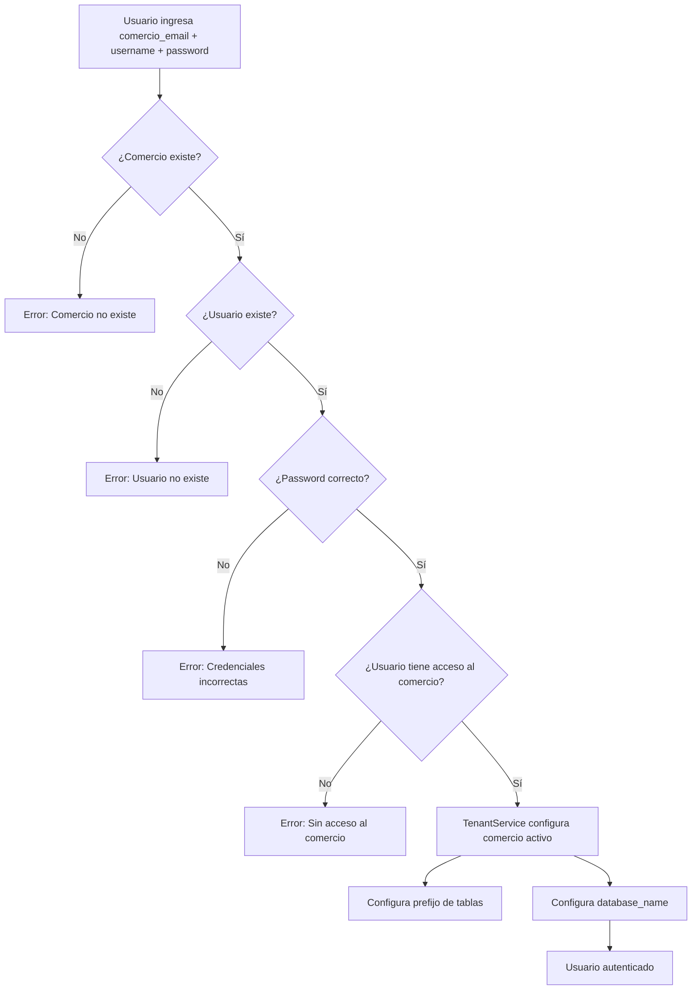

# Estructura Multi-Tenant BCN Pymes

> **Última actualización**: 2025-11-04
> **Versión**: 2.0.0

## 📋 Índice

- [Arquitectura General](#arquitectura-general)
- [Bases de Datos](#bases-de-datos)
- [Tablas Compartidas](#tablas-compartidas)
- [Tablas por Comercio](#tablas-por-comercio)
- [Modelos y Conexiones](#modelos-y-conexiones)
- [Flujo de Login](#flujo-de-login)
- [Creación de Nuevos Comercios](#creación-de-nuevos-comercios)

---

## 🏗️ Arquitectura General

El sistema utiliza un modelo **multi-tenant con prefijos de tabla**, donde:

- **Tablas compartidas**: Estructuras maestras usadas por todos los comercios (menú, permisos)
- **Tablas por comercio**: Datos específicos de cada comercio con prefijo `XXXXXX_` (roles, usuarios, ventas, etc.)
- **Base de datos dinámica**: Cada comercio puede estar en una BD diferente (`pymes`, `pymes1`, `resto`, etc.)

### Diagrama de Arquitectura

```
┌─────────────────────────────────────────┐
│  BD: config                             │
│  ├─ comercios                           │
│  │   ├─ id                              │
│  │   ├─ mail                            │
│  │   ├─ nombre                          │
│  │   └─ database_name ← Define BD       │
│  │                                      │
│  ├─ users                               │
│  └─ user_comercio (pivot)              │
└─────────────────────────────────────────┘
                    │
                    ▼
┌─────────────────────────────────────────┐
│  BD: pymes (o pymes1, pymes2, resto)    │
│                                         │
│  COMPARTIDAS (sin prefijo):             │
│  ├─ menu_items                          │
│  └─ permissions                         │
│                                         │
│  POR COMERCIO (prefijo 000001_):        │
│  ├─ 000001_roles                        │
│  ├─ 000001_role_has_permissions         │
│  ├─ 000001_model_has_roles              │
│  ├─ 000001_model_has_permissions        │
│  │                                      │
│  └─ Tablas de negocio (futuras):        │
│     ├─ 000001_ventas                    │
│     ├─ 000001_articulos                 │
│     ├─ 000001_clientes                  │
│     └─ ...                              │
└─────────────────────────────────────────┘
```

---

## 💾 Bases de Datos

### BD Config (Global)
**Ubicación**: Única para todo el sistema
**Propósito**: Datos centralizados de usuarios y comercios

| Tabla | Descripción |
|-------|-------------|
| `comercios` | Registro de todos los comercios del sistema |
| `users` | Todos los usuarios (compartidos entre comercios) |
| `user_comercio` | Relación many-to-many entre usuarios y comercios |

### BD Pymes / Resto (Por tipo de negocio)
**Ubicación**: Una BD por tipo de negocio
**Propósito**: Datos de negocio y configuración por comercio

**Tipos de BD planeados**:
- `pymes`: Comercios retail/PYMES
- `pymes1`, `pymes2`, etc.: Escalamiento horizontal de PYMES
- `resto`: Comercios gastronómicos (futuro)

---

## 📚 Tablas Compartidas

Estas tablas **NO tienen prefijo** y son compartidas por todos los comercios de la misma BD.

### `menu_items`
**Conexión**: `pymes` (sin prefijo)
**Propósito**: Estructura del menú de navegación del sistema

| Campo | Tipo | Descripción |
|-------|------|-------------|
| id | bigint | ID único |
| parent_id | bigint nullable | ID del padre (null = raíz) |
| nombre | varchar(100) | Nombre visible en el menú |
| slug | varchar(100) | Identificador único |
| icono | varchar(100) nullable | Icono Heroicons |
| route_type | enum | 'route', 'component', 'none' |
| route_value | varchar(255) nullable | Ruta Laravel o componente |
| orden | int | Orden de visualización |
| activo | boolean | Si está visible |

**Ejemplo de registros**:
```
- Dashboard (slug: dashboard)
- Ventas (slug: ventas) → padre
  ├─ Nueva Venta (slug: nueva-venta)
  ├─ Listado de Ventas (slug: listado-ventas)
  └─ Reportes (slug: reportes-ventas)
```

### `permissions`
**Conexión**: `pymes` (sin prefijo)
**Propósito**: Catálogo maestro de permisos del sistema

| Campo | Tipo | Descripción |
|-------|------|-------------|
| id | bigint | ID único |
| name | varchar(255) | Nombre del permiso (ej: menu.ventas) |
| guard_name | varchar(255) | Guard de Laravel (web) |

**Permisos generados automáticamente desde menu_items**:
- `menu.dashboard`
- `menu.ventas`
- `menu.nueva-venta`
- `menu.listado-ventas`
- etc.

---

## 🏪 Tablas por Comercio

Estas tablas **SÍ tienen prefijo** según el ID del comercio.

### Formato de Prefijo
- Comercio ID 1 → `000001_`
- Comercio ID 2 → `000002_`
- Comercio ID 999 → `000999_`

### Tablas Spatie Permission (Roles y Permisos)

#### `{prefix}_roles`
**Ejemplo**: `000001_roles`
**Propósito**: Roles específicos del comercio

| Campo | Tipo | Descripción |
|-------|------|-------------|
| id | bigint | ID único |
| name | varchar(125) | Nombre del rol |
| guard_name | varchar(125) | Guard de Laravel |

**Roles por defecto**:
- Administrador (acceso total)
- Gerente (sin configuración de usuarios)
- Vendedor (solo ventas)
- Visualizador (solo lectura)

#### `{prefix}_role_has_permissions`
**Ejemplo**: `000001_role_has_permissions`
**Propósito**: Relación entre roles del comercio y permisos compartidos

| Campo | Tipo | FK |
|-------|------|-----|
| permission_id | bigint | → `permissions.id` |
| role_id | bigint | → `000001_roles.id` |

#### `{prefix}_model_has_roles`
**Ejemplo**: `000001_model_has_roles`
**Propósito**: Asignación de roles a usuarios

| Campo | Tipo | FK |
|-------|------|-----|
| role_id | bigint | → `000001_roles.id` |
| model_type | varchar(100) | Clase del modelo (User::class) |
| model_id | bigint | ID del usuario |

#### `{prefix}_model_has_permissions`
**Ejemplo**: `000001_model_has_permissions`
**Propósito**: Permisos directos a usuarios (opcional)

| Campo | Tipo | FK |
|-------|------|-----|
| permission_id | bigint | → `permissions.id` |
| model_type | varchar(100) | Clase del modelo |
| model_id | bigint | ID del usuario |

---

## 🔮 Tablas de Negocio (Futuras)

Estas tablas se crearán conforme se desarrolle el sistema.
**TODAS llevarán prefijo del comercio**.

### Planeadas

```
000001_ventas
000001_ventas_items
000001_compras
000001_compras_items
000001_articulos
000001_categorias
000001_clientes
000001_proveedores
000001_inventario
000001_movimientos_stock
000001_cajas
000001_movimientos_caja
000001_configuraciones
```

**NOTA**: La estructura exacta se definirá durante el desarrollo.

---

## 🔗 Modelos y Conexiones

### Modelos con Conexión `config`
```php
protected $connection = 'config';
```
- `User`
- `Comercio`

### Modelos con Conexión `pymes` (compartida)
```php
protected $connection = 'pymes';
```
- `MenuItem`
- `Permission`

### Modelos con Conexión `pymes_tenant` (dinámica con prefijo)
```php
protected $connection = 'pymes_tenant';
```
- `Role`
- Futuros: `Venta`, `Articulo`, `Cliente`, etc.

---

## 🔐 Flujo de Login



### TenantService - Configuración Dinámica

Cuando se establece un comercio activo:

```php
// Se lee el comercio
$comercio = Comercio::find(1);

// Se configuran ambos parámetros:
Config::set('database.connections.pymes_tenant.prefix', '000001_');
Config::set('database.connections.pymes_tenant.database', 'pymes');

// Ahora todos los modelos con conexión 'pymes_tenant'
// usarán la BD 'pymes' con prefijo '000001_'
```

---

## 🚀 Creación de Nuevos Comercios

### Estado Actual: Manual

Actualmente, la creación de comercios es **manual** y requiere:

1. Insert en tabla `comercios`
2. Creación de tablas con prefijo
3. Creación de roles por defecto
4. Asignación de permisos a roles
5. Creación de usuario administrador

### Futuro: Comando Automatizado

**PENDIENTE DE IMPLEMENTAR** (después de tener estructura completa)

```bash
php artisan comercio:create
```

Ver archivo `RECORDATORIO_CREAR_COMERCIO.md` para más detalles.

---

## 📖 Referencias

- **Seeders**: `database/seeders/MenuItemSeeder.php`, `RolePermissionSeeder.php`
- **Modelos**: `app/Models/MenuItem.php`, `Permission.php`, `Role.php`, `Comercio.php`
- **Servicios**: `app/Services/TenantService.php`
- **Config**: `config/database.php`, `config/permission.php`

---

## 🔄 Changelog

### v2.0.0 (2025-11-04)
- Reestructuración multi-tenant
- Tablas compartidas: menu_items, permissions
- Campo database_name en comercios
- TenantService actualizado para soportar múltiples BDs

### v1.0.0 (2025-11-03)
- Implementación inicial multi-tenant con prefijos
